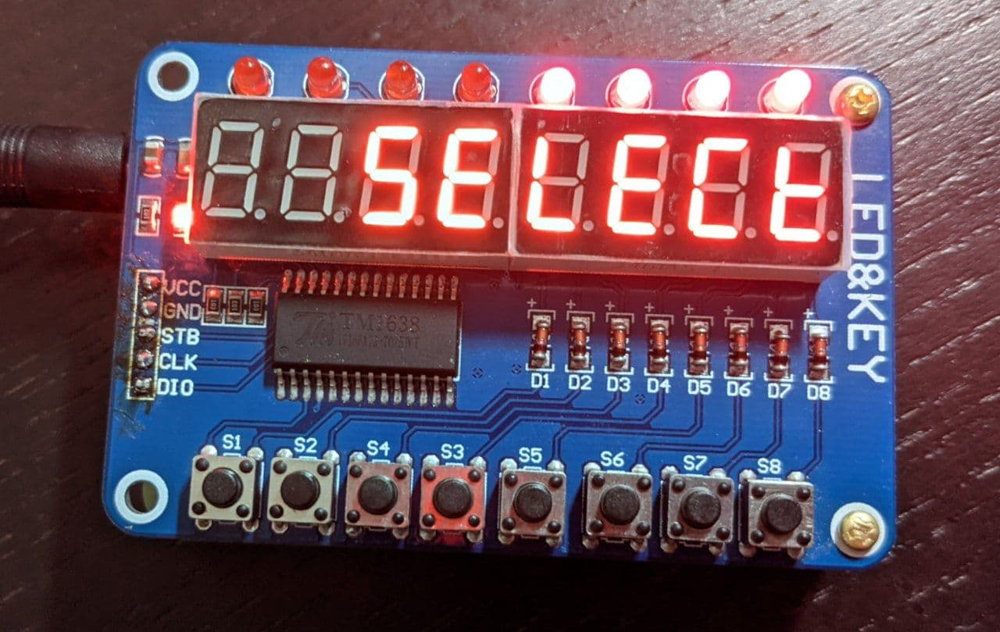
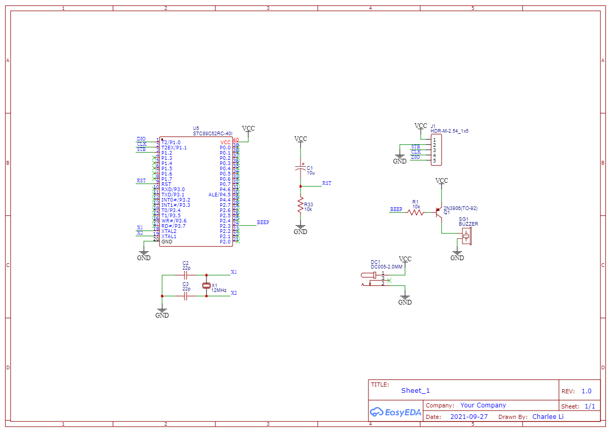
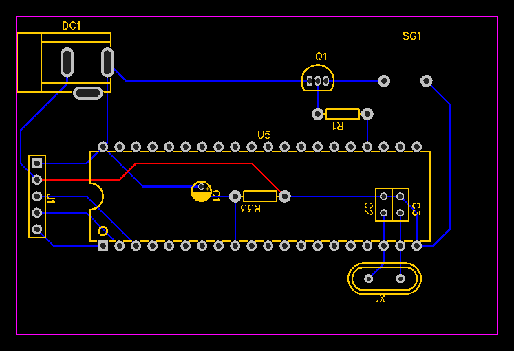

TM1638 Counter
==============

This is a multi-purpose counter based on [TM1638 module](https://www.amazon.ca/8-Bit-Digital-Tube-TM1638-Module/dp/B00GNSO62Q).

Also check the [pictures](images/) of this project.

## Features

This project featuers the following functionalities.

* Timer
* Stopwatch
* Counter
* Double counter

The TM1638 module contains 8 LEDs. In this project, these LEDs are used as functionality indicators.

In the menu screen, the 7segs shows "SELECT", and the keys are used to select a functionality.
After one of the keys is pressed, the 7segs will display the name of the functionality shortly,
then start the functionality.

1. unused
2. unused
3. unused
4. unused
5. Double Counter ("2COUNT")
6. Counter ("COUNT")
7. Stopwatch ("STOP")
8. Timer ("TIMER")

In each functionality, the keys are defined as follows:

**Double Counter**

* Key 1: Quit (press twice to quit)
* Key 2: Reset Counter 1 (press twice to reset)
* Key 3: Counter 1 + 10
* Key 4: Counter 1 + 1
* Key 5: unused
* Key 6: Reset Counter 2 (press twice to reset)
* Key 7: Counter 2 + 10
* Key 8: Counter 2 + 1

**Counter**

* Key 1: Quit (press twice to quit)
* Key 2: Reset Counter (press twice to reset)
* Key 3: Counter - 100
* Key 4: Counter - 10
* Key 5: Counter - 1
* Key 6: Counter + 100
* Key 7: Counter + 10
* Key 8: Counter + 1

**Stopwatch**

* Key 1: Quit (press twice to quit)
* Key 2: unused
* Key 3: unused
* Key 4: unused
* Key 5: unused
* Key 6: unused
* Key 7: Reset
* Key 8: Start & Stop

**Timer**

* Key 1: Quit (press twice to quit)
* Key 2: Rest (press twice to reset)
* Key 3: Clear (press twice to set to original duration)
* Key 4: unused
* Key 5: Hour + 1
* Key 6: Minute + 1
* Key 7: Second + 1
* Key 8: Start & Stop

Timer will beep for 3 times when completed.

## Schematics

Here is the schematics of the controller.

The PCB layout.

## Development

This project is originally developed under Windows.

Install [SDCC](http://sdcc.sourceforge.net/)

Install `make`:

    > chocolatey.exe install make

To generate the HEX file, simply run `make` under the `src` directory.
